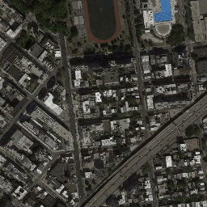
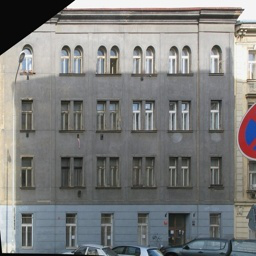

#  Image-to-Image Translation with Conditional Adversarial Nets
An implementation of pix2pix described in the paper using tensorflow.
* [ Image-to-Image Translation with Conditional Adversarial Nets](https://arxiv.org/pdf/1611.07004.pdf)

Published in CVPR 2017, written by P. Isola, J-Y Zhu, T. Zhou and A. Efros

## Requirement
- Python 3.6.4
- Tensorflow 1.8.0 
- Pillow 5.0.0
- numpy 1.14.5

## How to Run
If you want to see more example commands, please refer to run.sh file in my repository.

Train

```
python main.py --tr_data_path ./dataSet/facades/train --transfer_type B_to_A --model_name facades
```

test

```
python main.py --mode test --val_data_path ./dataSet/facedes/val --transfer_type B_to_A --load_size 256 --pre_trained_model ./model/pix2pix-facades
```

## Datasets
Shell script which downloads datasets will be uploaded soon!

## Pre-trained model
Pre-trained model will be uploaded soon!


## Experimental Results

Experimental results on map dataset(map to ariel)

| Input | result | Target |
| --- | --- | --- |
|  | |  |
|  |  |  |
|  |  |  |
|  |  |  |

Experimental results on map dataset(ariel to map)

| Input | result | Target |
| --- | --- | --- |
|  |  |  |
|  |  |  |
|  |  |  |
|  |  |  |

Experimental results on facades dataset

| Input | result | Target |
| --- | --- | --- |
|  |  |  |
|  |  |  |
|  |  |  |
|  |  |  |


Experimental results on edges2shoes dataset

| Input | result | Target |
| --- | --- | --- |
|  |  |  |
|  |  |  |
|  |  |  |
|  |  |  |


## Comments
If you have any questions or comments on my codes, please email to me. [son1113@snu.ac.kr](mailto:son1113@snu.ac.kr)

### Reference
[1] https://github.com/phillipi/pix2pix
